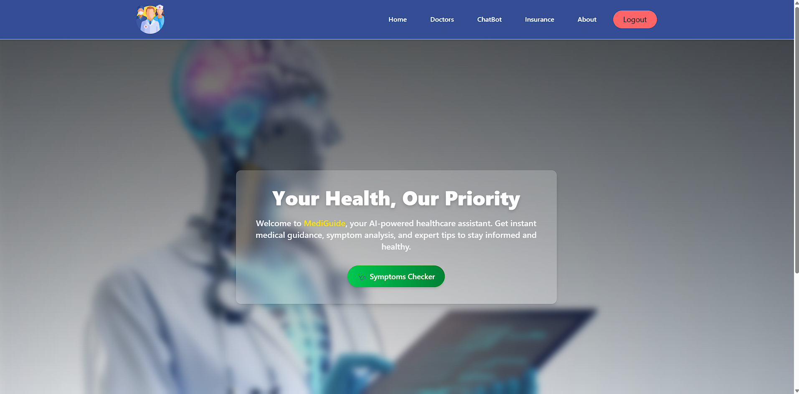
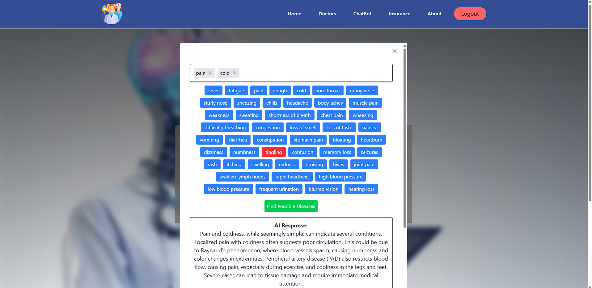
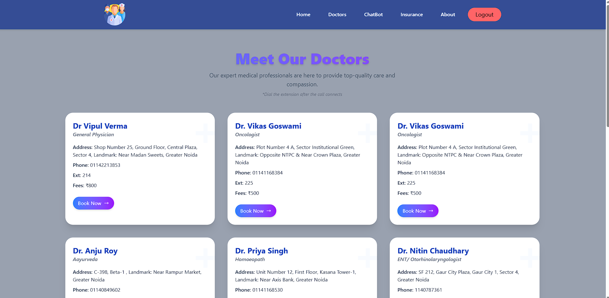
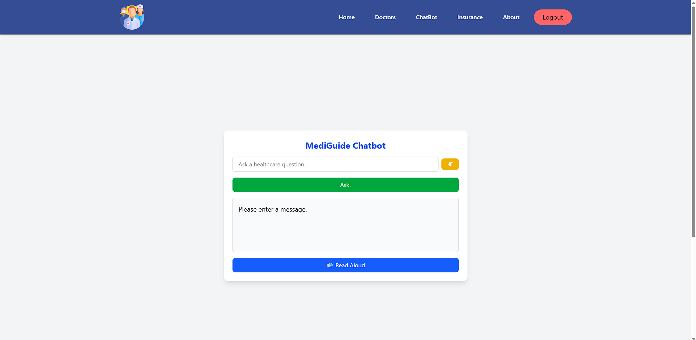
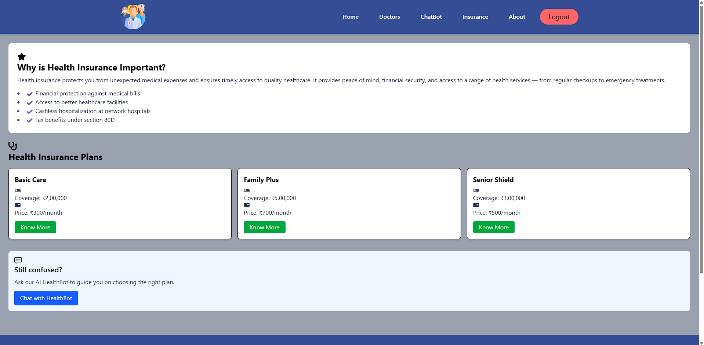
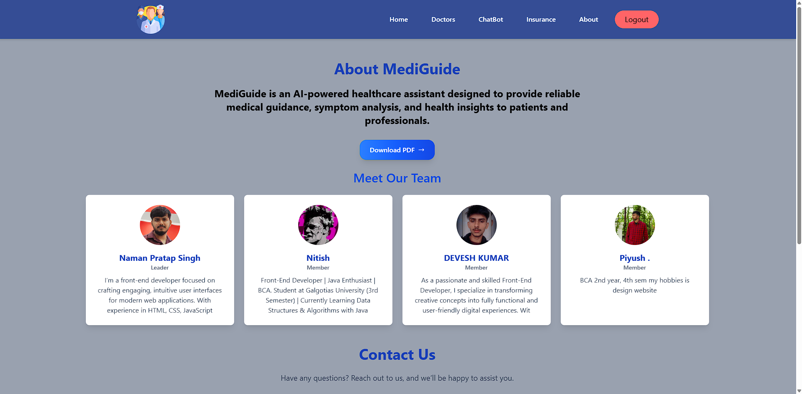

# 🩺 AI Healthcare Chatbot

An AI-powered healthcare chatbot platform that gives users 24/7 access to medical advice, doctor info, and insurance assistance using React and OpenAI.

## 📚 Table of Contents

- [Features](#-features)
- [Tech Stack](#-tech-stack)
- [Getting Started](#-getting-started)
- [Screenshots](#-screenshots)
- [Future Scope](#-future-scope)
- [License](#-license)

## 🚀 Features

- 💬 AI Chatbot with Gemini and Deepseek R1 Api
- 🔐 User login & signup with Appwrite
- 🧑‍⚕️ Doctor information page
- 🛡️ Health insurance details
- 🌐 Responsive design with Tailwind CSS

## 🧰 Tech Stack

| Role       | Technologies Used                   |
| ---------- | ----------------------------------- |
| Frontend   | React.js, Tailwind CSS              |
| Backend    | Appwrite (Auth + Database)          |
| AI Support | Gemini and DeepseekR1 API (Chatbot) |
| Routing    | React Router DOM                    |
| State Mgmt | Redux Toolkit                       |

## 🛠️ Getting Started

### 1. Clone the Repository

```bash
git clone https://github.com/Nitish-kumar-shah/healthCare.git
cd healthcare-chatbot
```

```bash
npm i
```

#then setup this
VITE_APPWRITE_ENDPOINT=your_appwrite_endpoint
VITE_APPWRITE_PROJECT_ID=your_project_id
VITE_OPENAI_API_KEY=your_openai_key

```bash
npm run dev
```

---

## ✅ STEP 8: Screenshots

Add 2–4 screenshots of your web app.

```md
## 🖼 Screenshots







```

## 🚀 Future Scope

- 📱 Launch mobile app version
- 🩺 Add doctor appointment & e-prescriptions
- 🌍 Multilingual chatbot support
- 🤖 Advanced AI diagnosis
- 🏥 Partner with real hospitals

## 🤝 Contribution

Pull requests are welcome!

## 👨‍💻 Built For

Code Astra Hackathon 2025 — Galgotias University
Team: Nitish, Naman, Devesh, Piyush
